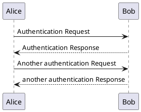

# 見出し１

## リスト

* 項目A
* 項目B
* 項目C

### テーブル

|左揃え|中央揃え|右揃え|
|:---|:---:|--:|
|align-left|align-center|align-right|
|セルの左揃えです|セルの中央揃えです|セルの右揃えです|

# コードの挿入

```
function hello(){
　return "hello world!";
}
```

***

# プラントUML

<details>
<summary>


</summary>



</details>
